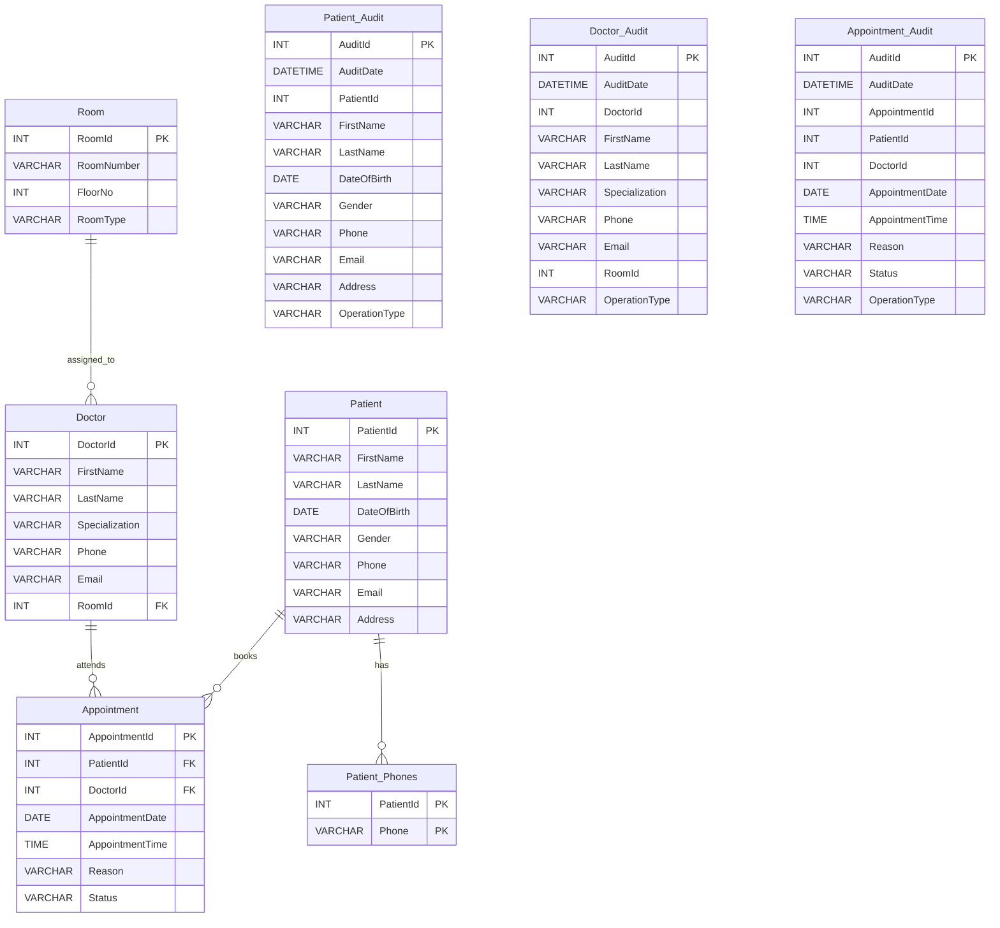

```mermaid
erDiagram
    Patient {
        INT PatientId PK
        VARCHAR FirstName
        VARCHAR LastName
        DATE DateOfBirth
        VARCHAR Gender
        VARCHAR Phone
        VARCHAR Email
        VARCHAR Address
    }

    Doctor {
        INT DoctorId PK
        VARCHAR FirstName
        VARCHAR LastName
        VARCHAR Specialization
        VARCHAR Phone
        VARCHAR Email
        INT RoomId FK
    }

    Room {
        INT RoomId PK
        VARCHAR RoomNumber
        INT FloorNo
        VARCHAR RoomType
    }

    Appointment {
        INT AppointmentId PK
        INT PatientId FK
        INT DoctorId FK
        DATE AppointmentDate
        TIME AppointmentTime
        VARCHAR Reason
        VARCHAR Status
    }

    Patient_Phones {
        INT PatientId PK
        VARCHAR Phone PK
    }

    Patient_Audit {
        INT AuditId PK
        DATETIME AuditDate
        INT PatientId
        VARCHAR FirstName
        VARCHAR LastName
        DATE DateOfBirth
        VARCHAR Gender
        VARCHAR Phone
        VARCHAR Email
        VARCHAR Address
        VARCHAR OperationType
    }

    Doctor_Audit {
        INT AuditId PK
        DATETIME AuditDate
        INT DoctorId
        VARCHAR FirstName
        VARCHAR LastName
        VARCHAR Specialization
        VARCHAR Phone
        VARCHAR Email
        INT RoomId
        VARCHAR OperationType
    }

    Appointment_Audit {
        INT AuditId PK
        DATETIME AuditDate
        INT AppointmentId
        INT PatientId
        INT DoctorId
        DATE AppointmentDate
        TIME AppointmentTime
        VARCHAR Reason
        VARCHAR Status
        VARCHAR OperationType
    }

    Patient ||--o{ Appointment : books
    Doctor ||--o{ Appointment : attends
    Room ||--o{ Doctor : assigned_to
    Patient ||--o{ Patient_Phones : has

```