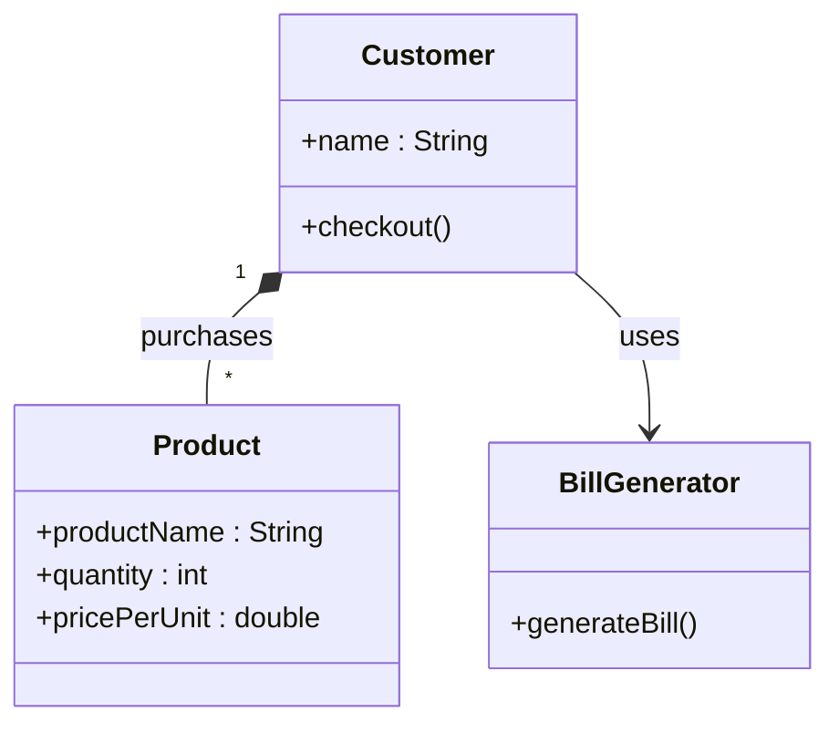
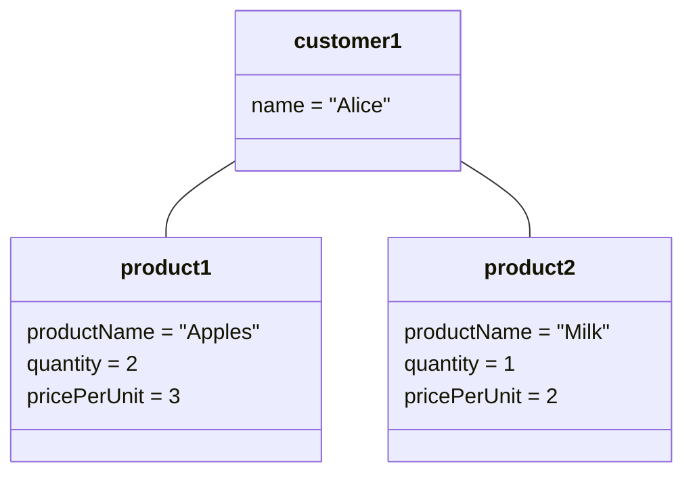
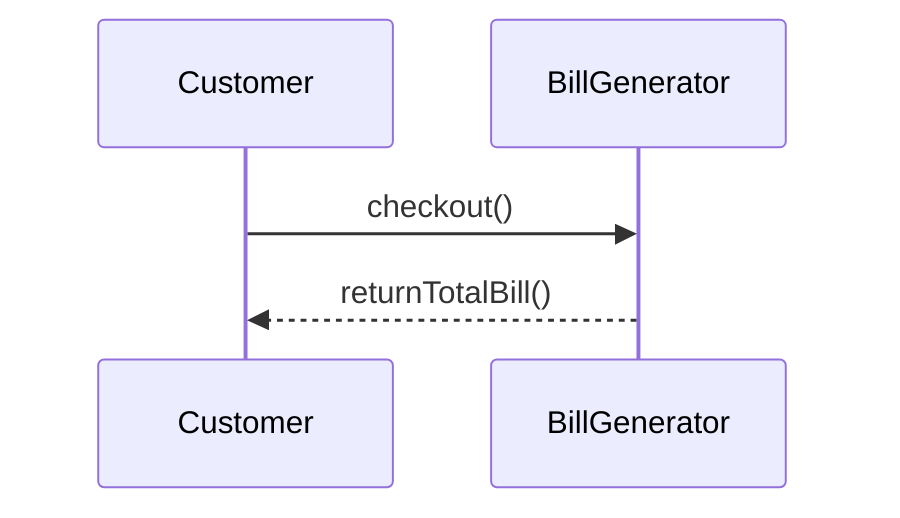

# Sample Problem 2: Grocery Store Bill Generation Application

This document demonstrates the use of Class Diagram, Object Diagram, and Sequence Diagram
for a Grocery Store Bill Generation Application using Mermaid.

---

## Class Diagram

The class diagram shows the structure of the grocery billing system and relationships between classes.

## Object Diagram
The object diagram represents the state of objects at a particular moment in time.

## Sequence Diagram
The sequence diagram shows interaction between objects during bill generation.

